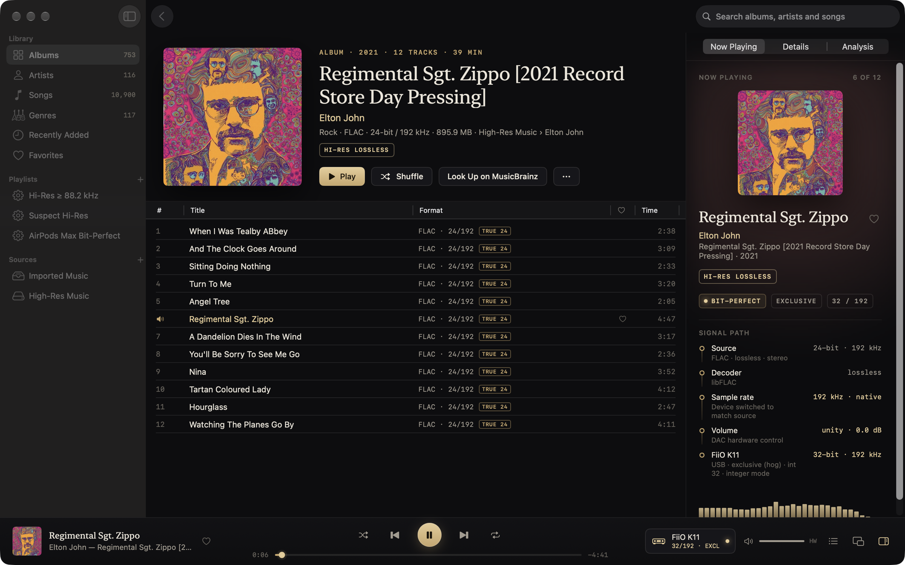
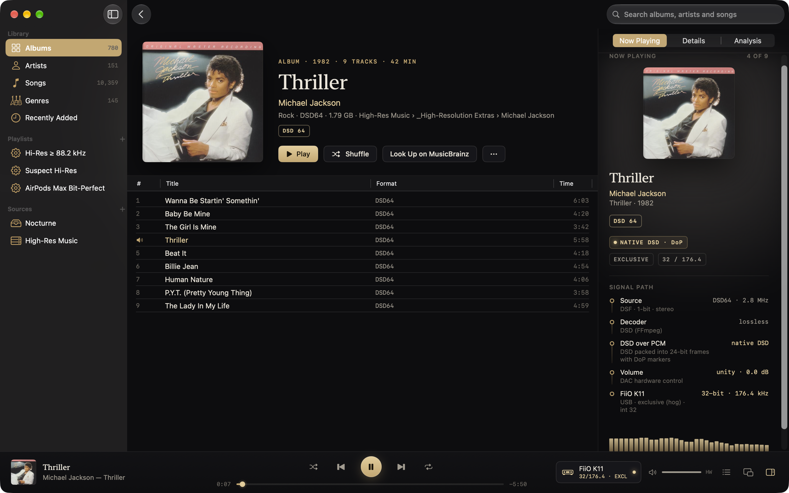
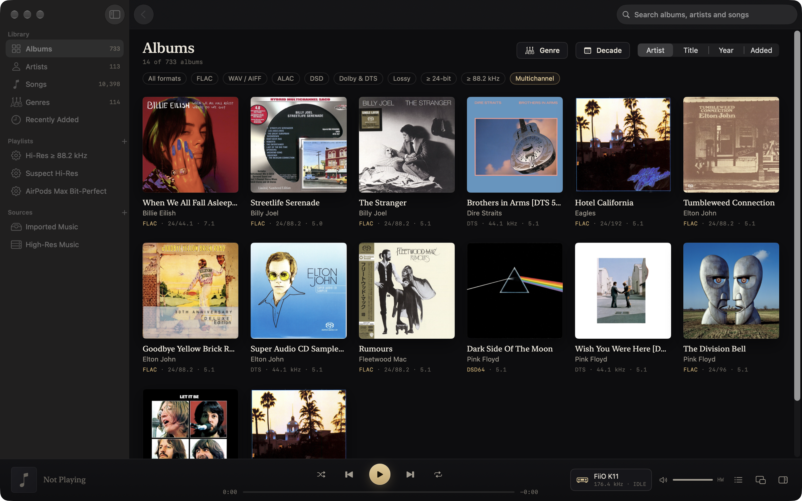
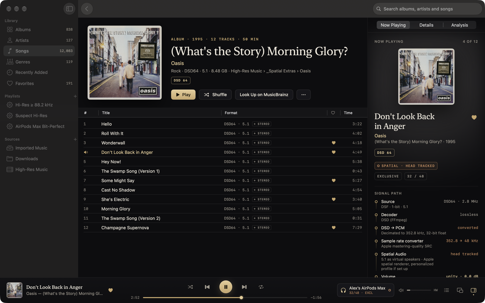
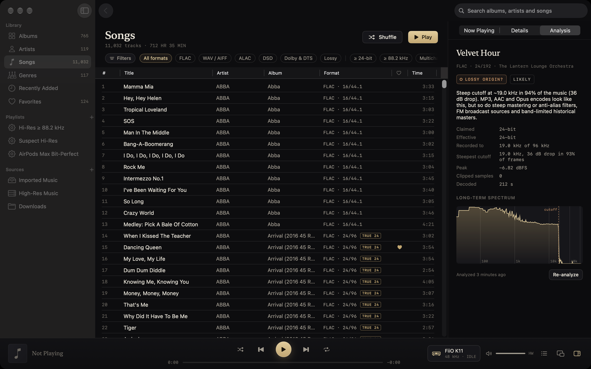
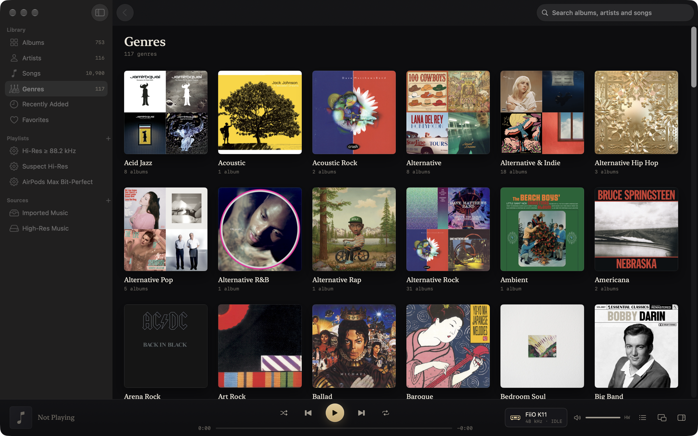
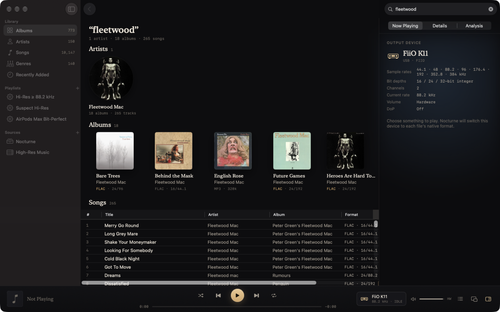
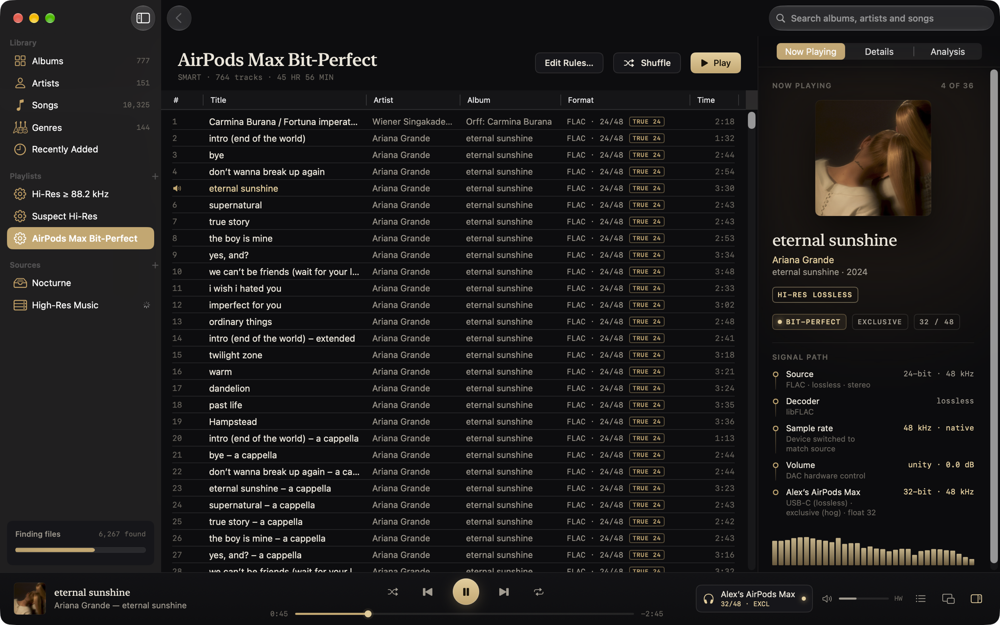
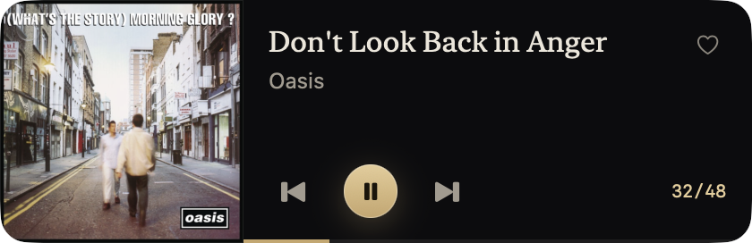

<p align="center">
  <picture>
    <source media="(prefers-color-scheme: dark)" srcset="docs/brand/logo.svg">
    
  </picture>
</p>

<p align="center">
  <strong>A free, open-source, bit-perfect music player for macOS.</strong><br>
  Native sample rates on your DAC, Spatial Audio on AirPods, and an honest signal path:<br>
  every rate and depth your DAC can run, DSD512, Dolby Atmos and DTS-HD Master Audio.
</p>

<p align="center">
  <a href="https://github.com/szeremeta1/Vespertine/releases/latest"></a>
  
  
  <a href="LICENSE"></a>
</p>

<p align="center">
  <a href="https://github.com/szeremeta1/Vespertine/releases/latest"><strong>Download Vespertine</strong></a> · <a href="https://szeremeta1.github.io/Vespertine/">Website</a> · signed, notarized, and it keeps itself up to date<br>
  or <code>brew install --cask szeremeta1/tap/vespertine</code>
</p>

<br>

<p align="center">
  
</p>

<p align="center"><sub>Vespertine was called Nocturne until version 0.6.0.</sub></p>

## Why Vespertine

Free Mac players tend to be either pretty but indifferent to what reaches the DAC, or careful about the signal but cumbersome to live with. Vespertine is meant to be both: a native Mac app that switches your DAC to each track's native format, shows **BIT-PERFECT** only when the conditions for it are met, and says what happened to the signal whenever they aren't ([check it on your own hardware](docs/VERIFICATION.md)). It also plays DTS CDs, TrueHD, DTS-HD Master Audio and Dolby Atmos files from the same library as your FLAC, renders surround as head-tracked Spatial Audio on AirPods, recognizes AirPods Max on USB-C as a lossless device, and flags "hi-res" files that aren't.

| | Vespertine | Apple Music | Audirvana Studio | Roon |
|---|---|---|---|---|
| Price | **Free, open source** | App free with macOS; streaming by subscription | $79.99 a year | $149.88 a year |
| Plays FLAC | Yes | No | Yes | Yes |
| Switches the DAC to each track's sample rate | Yes | No | Yes | Yes |
| Exclusive (hog) mode | Yes | No | Yes | Yes |
| Says when playback is bit-perfect | Yes | No | Shows the DAC format | Yes |
| DSD | DSD64–512 | No | Yes | Yes |
| Local multichannel | Yes | Multichannel ALAC | Yes | Yes |
| Local Dolby Atmos files | Yes | Subscription catalog | No | No |
| Fake hi-res detection | Yes | No | AudioScan (no DSD or multichannel) | No |
| Streaming (Qobuz, TIDAL) | No | Apple Music (paid) | Yes | Yes |
| EQ and room correction | No | Basic EQ | Yes | Yes |

<sub>Checked September 2026 from each product's own pricing and support pages. If you stream or need room correction, the paid apps are worth it; if you own your music, Vespertine is the one to try.</sub>

Vespertine plays almost anything you have: FLAC, ALAC, WAV and AIFF up to 32-bit and whatever rate your DAC runs (tested to 384 kHz), DSD from DSD64 to DSD512, Dolby Atmos, Dolby TrueHD, Dolby Digital (Plus), DTS-HD Master Audio, DTS CDs, APE, WavPack, TTA, Opus, Vorbis, Musepack, MP3 and AAC. It switches your DAC to each file's native format and tells you exactly what happens to the signal on the way there. It has been tested on a FiiO K11 and AirPods Max on USB-C; other class-compliant DACs should work, and [reports are welcome](https://github.com/szeremeta1/Vespertine/issues/new?template=dac_report.yml).

## Highlights

### Bit-perfect, all the way up
The device follows every track's native format, and **BIT-PERFECT** appears only when nothing touches the samples. Here a 24-bit / 192 kHz FLAC plays untouched on a FiiO K11. With exclusive access, **integer mode** sends 32-bit integers straight to the DAC, so even 32-bit recordings arrive exactly as stored.



### Native DSD, at any rate
DSD64, DSD128, DSD256 and DSD512, in DSF or DSDIFF. On a DAC that takes DoP, the DSD goes out untouched in DoP frames, and the meters and spectrum still show the music. Anywhere else it's converted to high-rate PCM, and the signal path says so.



### Surround, Dolby and DTS, wherever you listen
5.1 and 7.1 in FLAC, DSD, Dolby TrueHD, DTS-HD Master Audio and even DTS CDs (which players that don't recognize them turn into full-scale noise) play as head-tracked Spatial Audio on AirPods, channel for channel on a multichannel interface or receiver, or folded down on a stereo DAC. **Dolby Atmos** in Dolby Digital Plus is rendered by macOS's own Atmos renderer, just as in Apple Music. Every page filters by format (FLAC, WAV/AIFF, ALAC, DSD, **Dolby & DTS**, lossy, 24-bit, 88.2 kHz and up, multichannel), so every surround album is one click away.



### Stereo or surround, whichever your output can play
When an album has every song in stereo and in 5.1, like an SACD's two layers, Vespertine lists each song once. It plays the 5.1 version on a multichannel output or with Spatial Audio on, and the stereo one on a stereo DAC. Switch from your DAC to AirPods mid-album and the next songs follow.



### Flags fake hi-res
Upsampled, padded, lossy-origin and "AI-enhanced" files are flagged, with the evidence shown. Only zero padding is exact; the rest is read from the spectrum and flagged as a question, with what else could explain it: some high-bitrate lossy files pass as genuine, and steep mastering filters, FM sources and tape or vinyl transfers can look suspicious ([how it works, and where it misses](docs/ANALYSIS.md#limits)). Here a 24/48 file shows a steep step at 16.3 kHz with a flat shelf above it that follows the music, the pattern of high frequencies synthesized over a lossy source.



<sub>The file in this screenshot is an unofficial “enhanced” 24/48 copy from the developer's own collection, not an official release. To see a verdict on files you can regenerate, [make a fake of your own](docs/ANALYSIS.md#reproducing).</sub>

### Browse like Apple Music, filter like an audiophile
Albums, artists, songs and **genres**, with the same filters on every page: the format chips combine ("FLAC, 24-bit, 88.2 kHz and up"), and the Filters panel adds genre, year, artist, exact sample rate, bit depth, channels, analysis verdict and source, each with how many albums or songs it leaves. Artists and genres follow the filter, each page remembers its own, and every page plays or **shuffles** what it shows: a genre, an artist, the 1970s, your 5.1 albums. Messy tags are handled: "Hip-Hop" and "hip hop" are one genre, multi-genre tags count under each, and localized genre names are merged.



### Search finds everything
Artists, albums (by title, artist, genre or year) and songs, in one place. Every word you type has to match, ignoring case and accents.



### Smart playlists, lossless on AirPods Max
Rules use the units shown everywhere else (48 kHz, 24-bit), so "every 24-bit / 48 kHz track" is one rule away. AirPods Max on USB-C are recognized as a lossless 24-bit / 48 kHz device, so that playlist plays bit-perfect on them, and the Digital Crown and volume keys still work.



### A mini player that still tells the truth

<p align="center"></p>

## Formats

| Format | Files | How it plays |
|---|---|---|
| FLAC, ALAC, WAV, AIFF | `.flac` `.m4a` `.wav` `.aiff`, CUE-sheet images | Native rate and depth, up to 32-bit and the rate your DAC runs (tested to 384 kHz); bit-perfect when the DAC can run the rate |
| DSD64 – DSD512 | `.dsf` `.dff` | DoP on DACs marked DoP-capable that support the carrier rate; otherwise DSD → PCM |
| Dolby Atmos | Dolby Digital Plus with Atmos in `.ec3` `.m4a` `.mp4` | Rendered by macOS (Spatial Audio on AirPods, heights on a multichannel output), or its 5.1/7.1 bed through Vespertine |
| Dolby TrueHD, MLP | `.thd` `.mlp` `.mka` | Lossless, can be bit-perfect; Atmos in TrueHD plays its lossless bed |
| Dolby Digital, Dolby Digital Plus | `.ac3` `.ec3`, Dolby in `.m4a` / `.mp4` | Decoded by macOS, or sent to a receiver untouched |
| DTS-HD Master Audio, DTS-HD High Resolution, DTS | `.dts` `.dtshd` `.mka` | Decoded by FFmpeg; Master Audio is lossless; DTS:X plays its bed |
| DTS CDs, DTS-WAV | `.wav` `.flac` (+ `.cue`) | Recognized and decoded to 5.1, or sent to a receiver untouched |
| APE, WavPack, TTA | `.ape` `.wv` `.tta` | Lossless |
| Opus, Vorbis, Musepack, MP3, AAC | `.opus` `.ogg` `.mpc` `.mp3` `.m4a` | Decoded, marked lossy |

The decoders have automated tests with generated fixtures: TrueHD output is compared sample for sample with its source, and DTS output with FFmpeg's own decoder on a real disc rip. Playback has been tested on a FiiO K11 (every rate up to 384 kHz), AirPods Max over USB-C and Bluetooth, and a MacBook Pro's speakers. The Intel half of the universal app has been run under Rosetta, not on an Intel Mac. No multichannel DAC or AV receiver has been available yet: channel routing is covered by tests and a six-channel aggregate device, and the bitstream bursts to a receiver were checked only against FFmpeg's S/PDIF reader. Not supported: DSD inside WavPack, DRM-protected Apple Music downloads, and sending TrueHD or DTS-HD MA to a receiver untouched (macOS gives apps no high-bit-rate HDMI passthrough).

## What it does

- **Automatic device format.** Each track's rate is matched on the device (16/44.1, 24/96, 24/192, 352.8, 384…). If the device can't run at that rate, Vespertine converts with Apple's mastering-quality resampler. It prefers a rate in the same family (44.1 → 88.2), then the nearest higher rate, then an integer divisor (768 → 384). Per-device overrides: *match source*, *device maximum* or a fixed rate.
- **Shared or exclusive.** By default Vespertine shares the device and makes it the Mac's sound output when it starts playing (it stays the sound output afterwards; there's a switch for this in Settings), so volume keys, Control Center and the AirPods Max Digital Crown control what you hear. Playback is still bit-perfect unless another app plays through the same device at the same time, and Vespertine says so when that happens. **Exclusive (hog) mode** is one switch away if you'd rather silence other apps on the device. The volume keys, Control Center and the Digital Crown still reach it, and the device is released after a configurable pause. The Mac's own speakers and headphone jack always play shared: exclusive access gains nothing there.
- **Integer mode.** With exclusive access, on DACs that offer it (the FiiO K11 does), music that needs no processing reaches the DAC as 32-bit integers with no floating-point step, so 32-bit recordings are bit-perfect too.
- **Stays on the output you chose.** Vespertine never switches your music to another device on its own. If the chosen output is missing when playback starts (AirPods Max still reconnecting after you put them back on, a DAC being replugged), it waits for it for up to a minute and plays the moment it's back. If it drops out mid-song, playback continues where it left off once it returns.
- **Hands your DAC back.** When Vespertine quits, each device it switched goes back to the sample rate and bit depth it had before (so other apps, and tools like LosslessSwitcher, carry on where they left off), or to 44.1 kHz · 16-bit or 48 kHz · 24-bit if you prefer.
- **AirPods Max over USB-C.** These are recognized as lossless 24-bit / 48 kHz devices (macOS still lists them as Bluetooth, so Vespertine detects the cable itself). 48 kHz material plays bit-perfect and everything else is converted to 48 kHz. Over Bluetooth, Vespertine tells you the link is AAC. AirPods Max 2 is recognized the same way, by name, but hasn't been tested.
- **DSD at every rate.** DSD64 to DSD512 in DSF and DSDIFF. DoP goes to DACs you mark as DoP-capable (off by default, because DoP sent to a non-DoP DAC is noise) at any rate the DAC can carry; anything else is converted to high-rate PCM.
- **Dolby Atmos.** Dolby Digital Plus with Atmos (the format Apple Music and streaming services use) is rendered by macOS's own Atmos renderer on the output you chose: head-tracked Spatial Audio on AirPods, height channels on a multichannel output. Or, if you prefer, its 5.1/7.1 bed plays through Vespertine's own path.
- **Dolby Digital, Dolby Digital Plus, Dolby TrueHD, DTS-HD Master Audio.** `.ac3`, `.ec3`, Dolby audio in M4A/MP4, `.dts`, `.dtshd`, `.thd` and Matroska audio (`.mka`) all play, each channel in its place. TrueHD and DTS-HD MA are lossless and can be bit-perfect. With DTS:X and TrueHD Atmos, Vespertine plays the lossless channel bed and says so; the objects need a receiver.
- **DTS CDs.** DTS 5.1 discs and DTS-WAV files (a DTS bitstream disguised as 16-bit stereo PCM) are recognized and decoded to 5.1, including albums split by a CUE sheet, so they play in surround or as Spatial Audio on AirPods.
- **Bitstream to an AV receiver.** Per output, Dolby Digital, Dolby Digital Plus (Atmos included, over HDMI) and DTS CDs can be sent untouched, in IEC 61937 bursts, for a receiver or soundbar to decode. This hasn't been tested on a real receiver yet; the bursts are validated against FFmpeg's S/PDIF reader.
- **Stereo and surround versions.** Albums with each song in stereo and in multichannel (SACD layers, Blu-ray mixes) list each song once and play the version that suits the output: surround on multichannel outputs and with Spatial Audio, stereo on stereo DACs. Or pin it to either in Settings.
- **Favorites.** A heart on any song, in the transport bar, Now Playing, the mini player, the menu-bar extra and every song list (⌘L favorites the song that's playing), and a Favorites page in the sidebar. Favorites live in your library and are never written to your files.
- **Format badges.** Now Playing and album pages name the format: Dolby Atmos, Dolby TrueHD, DTS-HD Master Audio, DSD 256, Hi-Res Lossless and so on.
- **Multichannel and Spatial Audio.** 5.0, 5.1, 7.1 and other multichannel files play everywhere: rendered with Apple's Spatial Audio (head tracked or fixed, with your personalized profile) on AirPods and Beats, sent channel-for-channel to multichannel interfaces and AV receivers (following your speaker setup, even when HDMI is left in 2-channel mode), or downmixed by layout on stereo DACs. The signal path always says which, with a live meter for every channel. No multichannel DAC or receiver has been available for testing yet; routing is covered by automated tests. **Export for Spatial Audio** turns them into binaural stereo that sounds spatial on any headphones, or multichannel ALAC for Apple devices.
- **A truthful signal path.** *BIT-PERFECT* (brass) appears only when the rate is native, nothing touches the samples, no other app is mixing into the device and the word length fits. Every other state is shown in copper with the reason. In shared mode, other apps are detected by polling about once a second, and processing inside the DAC itself is outside what macOS reports ([what it checks, and what it can't see](docs/VERIFICATION.md#what-bit-perfect-doesnt-cover)).
- **Gapless playback** across tracks that share a device format, including CUE-sheet albums split from a single file.
- **Volume.** Vespertine uses the DAC's hardware volume when it has one. Optionally, a 64-bit dithered digital volume can be enabled; it's clearly marked as not bit-perfect.
- **Damaged files are contained.** Exceptions thrown inside codec libraries are caught, so a broken file usually just won't play, with a message saying why. (A crash deep inside a decoder can't be caught this way; please report any file that does it.)
- **Find Music on This Mac.** Spotlight searches every drive it has indexed. Each file's true format is checked, and hi-res, lossless or all music can be picked by folder or by file. Recordings, prompts, clips and duplicate copies are left out.
- **Library.** Folders are referenced in place and watched for changes, or you can *Import & Organize* to copy music into `~/Music/Vespertine`. On the same drive the copies are APFS clones and take no extra space. It keeps albums, artists, songs and genres, each page with its own filters (format, sample rate, bit depth, channels, genre, decade, artist, analysis verdict, source, favorites) and Play and Shuffle (albums are dated by their original release, not the reissue you have); search across artists, albums (title, artist, genre, year) and songs (accent-insensitive); playlists; and smart playlists whose rules use the same units as the rest of the app. Covers come from the files, from the album folder (including one above a "CD 1" folder), and are picked up when you add one later. Files on unplugged drives stay in the library and show as offline; files you delete disappear from every list on the next scan (and come back if you restore them). Files that are moved or renamed, for example by Lidarr reorganizing a share, are recognized as the same songs, so playlists, play counts and analysis stay with them.
- **Rich metadata editing** for single tracks or batches, written into the files via TagLib (Vorbis comments, ID3v2, MP4, APE). It covers artwork, sort fields, lyrics and custom tags. Each file is cloned to a backup (instant on APFS) and the previous tags are kept for one-step revert. Files Vespertine can't write (a read-only share, one file of a CUE image) keep their edits in the library instead, through rescans.
- **Enrich Metadata.** Missing titles, artists, albums, years, track numbers and cover art are filled in from structured file names and **MusicBrainz / Cover Art Archive**. Each proposal shows its source and confidence before anything is written.
- **MusicBrainz and Cover Art Archive** lookup and correction, and **ListenBrainz** scrobbling (optional; the token is kept in the Keychain).
- **Network shares.** Connect to SMB, NFS or WebDAV shares on your network or over Tailscale/VPN (⌘K). Read-only by default and mounted where macOS keeps network volumes (hidden from the Finder sidebar). They heal themselves: Vespertine reconnects after sleep, network changes and server restarts, and remounts a share that has stopped answering. Shares are rescanned every half hour (never while you're playing from them), so music added to or deleted from the server shows up by itself. Indexing is quick over slow links, and playback is built for slow or busy servers. It keeps up to half a minute of audio in hand, copies the playing track to the Mac straight away, and moves playback to that copy mid-song, sample for sample, the moment it's complete, so the rest of the song no longer depends on the network. What you play is cached, with **Keep Offline** for whole albums. Passwords live in the login keychain alongside Finder's.
- **Fake hi-res detection.** Finds 16-bit audio padded into 24-bit files (exactly), and flags likely upsampled "hi-res", lossy-origin files, and "enhanced" files whose high frequencies look synthesized (SBR or AI upscaling). Those three are heuristics: every verdict shows its evidence and names what else could explain it; some high-bitrate lossy files pass as genuine, and some genuine recordings with steep filters look suspicious ([limits](docs/ANALYSIS.md#limits)). Results are saved, can run automatically on import, and can filter any page. A *Suspect Hi-Res* smart playlist collects them. For music on a NAS or server, `vespertine-analyze` runs the same analysis next to the files and Vespertine imports the results, so nothing is read over the network. [How it works](docs/ANALYSIS.md).
- **Live spectrum** of exactly what the DAC receives (DSD over DoP included), plus a mini player, a menu-bar extra and full Now Playing / media-key integration.

## Build

```bash
brew install xcodegen
```

```bash
xcodegen generate && open Vespertine.xcodeproj
```

Or build from the command line:

```bash
xcodebuild -project Vespertine.xcodeproj -scheme Vespertine -configuration Release -derivedDataPath build/DD build
```

Run the engine and library tests, and the analysis core's (it also builds on Linux):

```bash
cd Packages/VespertineKit && swift test
```

```bash
cd Packages/VespertineAnalysis && swift test
```

`scripts/audit.sh` runs everything above plus the app tests, sanitizer builds of the real-time C code and a release build.

The FFmpeg decoders for DTS, TrueHD and DSD ship prebuilt in `Packages/VespertineKit/Vendor/FFmpegDCA.xcframework`. To rebuild them from FFmpeg's release tarball (checksum-verified, only those decoders enabled):

```bash
scripts/build-dts-decoder.sh
```

## Try it without your own music

`vespertine-demo` synthesizes an original demo library of 13 fictional albums in every supported container, including DSD64, a CUE-split album, a deliberately fake 24-bit track and an upsampled "hi-res" album:

```bash
cd Packages/VespertineKit && swift run -c release vespertine-demo ~/Desktop/VespertineDemo
```

To launch against an isolated test library, so your real one is untouched:

```bash
build/DD/Build/Products/Release/Vespertine.app/Contents/MacOS/Vespertine -VespertineDataDirectory /tmp/vespertine-test -VespertineAddSource ~/Desktop/VespertineDemo
```

For Dolby, DTS and TrueHD samples, [FFmpeg's FATE suite](https://fate-suite.ffmpeg.org/) has short clips of each (`ac3/`, `eac3/`, `dts/`, `dca/`, `truehd/`), and `Packages/VespertineKit/Tests/VespertineAudioTests/Fixtures` has tone files made with FFmpeg's encoders.

### Hardware verification

[docs/VERIFICATION.md](docs/VERIFICATION.md) explains how to check bit-perfect playback on your own hardware. `vespertine-probe` drives the real engine against a device and reads back what Core Audio actually did (nominal rate, physical format, hog owner):

```bash
cd Packages/VespertineKit && swift build -c release --product vespertine-probe
```

```bash
.build/release/vespertine-probe list
```

```bash
.build/release/vespertine-probe play "FiiO K11" 3 ~/Music/a.flac ~/Music/b.flac
```

`vespertine-library` runs the same library code from the command line:
- `find` lists folders with music;
- `hires` lists every hi-res file;
- `search <term>` searches tags;
- `import --library <dir> --into <dir> <files…>` imports;
- `enrich --library <dir> [--apply high|all]` enriches;
- `import-server-analysis --library <dir>` imports a share's server analysis results.

`gapless <device> <files…>` plays a queue and reports hand-offs and underruns. `analyze <files…>` runs the analysis (`analyze-json` prints it as JSON, for comparing with `vespertine-analyze file`); `forensics <files…>` prints its raw measurements as a table; `restore-test <device>` checks the quit options that hand a device back.

`scripts/qa-run.sh` and `App/Sources/App/DeveloperHooks.swift` hold the launch arguments used for visual QA. They can open albums, artists and genres, start playback or a shuffle, set any page's filters, select inspector tabs and render windows to PNG, which works even while the screen is locked.

## Releasing

```bash
scripts/release.sh --notarize --install
```

```bash
scripts/publish.sh docs/releases/<version>.md
```

The first command builds a universal app and signs it (and every embedded framework and Sparkle helper) with the Developer ID. It then notarizes and staples both the app and a designed installer DMG. If Apple takes longer than two hours, rerun it with `--resume` instead of `--notarize`.

The second command publishes the GitHub release: it signs the Sparkle appcast entry with the EdDSA key in the login keychain (account `nocturne`, kept from before the rename so the key never changes) and uploads `appcast.xml` next to the DMG. Installed copies read the feed from `releases/latest/download/appcast.xml`.

**Back up the Sparkle signing key.** Without it, no future update can be published to existing installs:

```bash
build/DDR/SourcePackages/artifacts/sparkle/Sparkle/bin/generate_keys --account nocturne -x vespertine-sparkle-key.txt
```

Store that file somewhere safe (it is a secret), then delete it.

## Layout

| Path | What |
|---|---|
| `Packages/VespertineKit/Sources/CVespertineRT` | Real-time C: lock-free ring buffer, HAL IOProc, dithered gain, integer mode, meters, spectrum tap (DoP included) |
| `Packages/VespertineKit/Sources/CVespertineDTS` | C shims over FFmpeg: DTS CDs, DTS-HD, TrueHD, Matroska and DSD |
| `Packages/VespertineKit/Sources/CVespertineGuard` | Objective-C++ guard that turns exceptions from codec libraries into errors |
| `Packages/VespertineKit/Sources/VespertineAudio` | Device discovery, shared/exclusive output, format switching, `FormatPlanner`, `PlaybackEngine`, Spatial Audio, Dolby Atmos, bitstream, decoders |
| `Packages/VespertineKit/Sources/VespertineLibrary` | GRDB/SQLite library, scanner, CUE, tag reader and writer, format badges, genres, smart playlists, network shares, server-analysis import, MusicBrainz/ListenBrainz |
| `Packages/VespertineKit/Vendor` | FFmpeg's DTS, TrueHD and DSD decoders, prebuilt (see `scripts/build-dts-decoder.sh`) |
| `Packages/VespertineAnalysis` | The analysis core (spectra, forensics, verdicts) in plain Swift, plus `vespertine-analyze` for Linux servers |
| `App/` | SwiftUI app (Obsidian & Brass design) |
| `docs/` | Architecture notes, design mockups, screenshots, release notes |

See [docs/ARCHITECTURE.md](docs/ARCHITECTURE.md) for how audio gets from file to DAC.

## How it's made

Vespertine is designed and maintained by Alexander Szeremeta. Most of the code was written with AI coding agents (Claude Code and Codex) under his direction, as the commit history shows: he sets the behavior, the design and the acceptance tests, and checks the audio paths on real hardware (a FiiO K11 at every rate up to 384 kHz, AirPods Max over USB-C and Bluetooth, and a MacBook Pro's speakers). No multichannel DAC or AV receiver has been available, so reports from other DACs, receivers and multichannel interfaces are especially welcome: [open a device report](https://github.com/szeremeta1/Vespertine/issues/new?template=dac_report.yml).

## License

GPL-3.0-or-later. See [LICENSE](LICENSE). Third-party components, with versions, sources and the FFmpeg build options, are listed in [THIRD-PARTY-NOTICES.md](THIRD-PARTY-NOTICES.md): SFBAudioEngine (MIT), GRDB (MIT), Sparkle (MIT), TagLib (LGPL/MPL), libFLAC (BSD), WavPack (BSD), Monkey's Audio (BSD), libopus/libvorbis/libogg (BSD), the Musepack decoder (BSD), mpg123 (LGPL), libsndfile (LGPL), LAME (LGPL), DUMB (zlib-like), TTA (LGPL), and FFmpeg's DTS, TrueHD/MLP and DSD decoders with its DTS, TrueHD, Matroska, DSF and DSDIFF demuxers (LGPL-2.1+, built from source by `scripts/build-dts-decoder.sh`).

## Trademarks

Dolby, Dolby Atmos, Dolby Digital, Dolby Digital Plus and Dolby TrueHD are trademarks of Dolby Laboratories. DTS, DTS-HD Master Audio and DTS:X are trademarks of DTS, Inc. Apple, AirPods, AirPods Max and Spatial Audio are trademarks of Apple Inc. Vespertine names these formats and products only to describe what it plays and where. It is not certified, licensed or endorsed by Dolby, DTS or Apple, and it doesn't use their logos.
