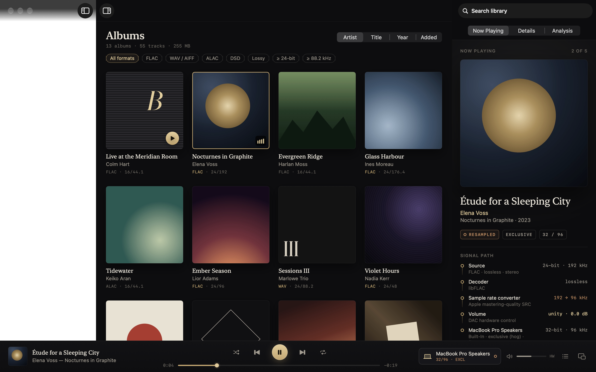

# Nocturne

A free, open-source, bit-perfect audio player for macOS 26 and later.

Nocturne plays FLAC, ALAC, WAV, AIFF, DSD (DSF/DSDIFF), APE, WavPack, TTA, Opus, Vorbis, Musepack, MP3, AAC and more. It switches your DAC (a FiiO K11, an AirPods Max on USB-C, anything class-compliant) to each file's native sample rate and bit depth, holds it exclusively, and tells you exactly what happens to the signal on the way there.



## What it does

- **Automatic device format.** Each track's rate is matched on the device (16/44.1, 24/96, 24/192, 352.8…). If the device can't run at that rate, Nocturne converts with Apple's mastering-quality resampler. It prefers a rate in the same family (44.1 → 88.2), then the nearest higher rate, then an integer divisor (384 → 192). Per-device overrides: *match source*, *device maximum* or a fixed rate.
- **Exclusive (hog) mode** is on by default, so system sounds and other apps can't mix into or resample your DAC. The device is released after a configurable pause.
- **AirPods Max / AirPods Max 2 over USB-C.** These are recognized as lossless 24-bit / 48 kHz devices. 48 kHz material plays bit-perfect and everything else is converted to 48 kHz. Over Bluetooth, Nocturne tells you the link is AAC.
- **DSD.** DSD goes to the DAC as DoP on DACs you mark as DoP-capable (off by default, because DoP sent to a non-DoP DAC is noise). Otherwise it's converted to high-rate PCM.
- **A truthful signal path.** *BIT-PERFECT* (brass) appears only when the rate is native, nothing touches the samples, the device is held exclusively and the word length fits. Every other state is shown in copper with the reason.
- **Gapless playback** across tracks that share a device format, including CUE-sheet albums split from a single file.
- **Volume.** Nocturne uses the DAC's hardware volume when it has one. Optionally, a 64-bit dithered digital volume can be enabled; it's clearly marked as not bit-perfect.
- **Find Music on This Mac.** Spotlight searches every drive. Each file's true format is checked, and hi-res, lossless or all music can be picked by folder or by file. Recordings, prompts, clips and duplicate copies are left out.
- **Library.** Folders are referenced in place and watched for changes, or you can *Import & Organize* to copy music into `~/Music/Nocturne`. On the same drive the copies are APFS clones and take no extra space. It keeps albums, artists, songs, full-text search (accent-insensitive), playlists and smart playlists. Files on unplugged drives stay in the library and show as offline.
- **Rich metadata editing** for single tracks or batches, written into the files via TagLib (Vorbis comments, ID3v2, MP4, APE). It covers artwork, sort fields, lyrics and custom tags. Each file is cloned to a backup (instant on APFS) and the previous tags are kept for one-step revert.
- **Enrich Metadata.** Missing titles, artists, albums, years, track numbers and cover art are filled in from structured file names and **MusicBrainz / Cover Art Archive**. Each proposal shows its source and confidence before anything is written.
- **MusicBrainz and Cover Art Archive** lookup and correction, and **ListenBrainz** scrobbling (optional; the token is kept in the Keychain).
- **Analysis.** Finds a file's true bit depth (catches 16-bit audio padded into 24-bit files) and its bandwidth (catches upsampled "hi-res" and lossy-origin files). A *Suspect Hi-Res* smart playlist collects the results.
- **Live spectrum** of exactly what the DAC receives, plus a mini player, a menu-bar extra and full Now Playing / media-key integration.

## Build

```bash
brew install xcodegen
```

```bash
xcodegen generate && open Nocturne.xcodeproj
```

Or build from the command line:

```bash
xcodebuild -project Nocturne.xcodeproj -scheme Nocturne -configuration Release -derivedDataPath build/DD build
```

Run the engine and library tests:

```bash
cd Packages/NocturneKit && swift test
```

## Try it without your own music

`nocturne-demo` synthesizes an original demo library of 13 fictional albums in every supported container, including DSD64, a CUE-split album, a deliberately fake 24-bit track and an upsampled "hi-res" album:

```bash
cd Packages/NocturneKit && swift run -c release nocturne-demo ~/Desktop/NocturneDemo
```

To launch against an isolated test library, so your real one is untouched:

```bash
build/DD/Build/Products/Release/Nocturne.app/Contents/MacOS/Nocturne -NocturneDataDirectory /tmp/nocturne-test -NocturneAddSource ~/Desktop/NocturneDemo
```

### Hardware verification

`nocturne-probe` drives the real engine against a device and reads back what Core Audio actually did (nominal rate, physical format, hog owner):

```bash
cd Packages/NocturneKit && swift build -c release --product nocturne-probe
```

```bash
.build/release/nocturne-probe list
```

```bash
.build/release/nocturne-probe play "FiiO K11" 3 ~/Music/a.flac ~/Music/b.flac
```

`nocturne-library` runs the same library code from the command line:
- `find` lists folders with music;
- `hires` lists every hi-res file;
- `search <term>` searches tags;
- `import --library <dir> --into <dir> <files…>` imports;
- `enrich --library <dir> [--apply high|all]` enriches.

`gapless <device> <files…>` plays a queue and reports hand-offs and underruns. `analyze <files…>` runs the bit-depth and bandwidth analysis.

`scripts/qa-run.sh` and `App/Sources/App/DeveloperHooks.swift` hold the launch arguments used for visual QA. They can open albums, start playback, select inspector tabs and render windows to PNG, which works even while the screen is locked.

## Releasing

```bash
scripts/release.sh --notarize --install
```

```bash
scripts/publish.sh docs/releases/<version>.md
```

The first command builds a universal app and signs it (and every embedded framework and Sparkle helper) with the Developer ID. It then notarizes and staples both the app and a designed installer DMG. If Apple takes longer than two hours, rerun it with `--resume` instead of `--notarize`.

The second command publishes the GitHub release: it signs the Sparkle appcast entry with the `nocturne` EdDSA key from the login keychain and uploads `appcast.xml` next to the DMG. Installed copies read the feed from `releases/latest/download/appcast.xml`.

**Back up the Sparkle signing key.** Without it, no future update can be published to existing installs:

```bash
build/DDR/SourcePackages/artifacts/sparkle/Sparkle/bin/generate_keys --account nocturne -x nocturne-sparkle-key.txt
```

Store that file somewhere safe (it is a secret), then delete it.

## Layout

| Path | What |
|---|---|
| `Packages/NocturneKit/Sources/CNocturneRT` | Real-time C: lock-free ring buffer, HAL IOProc, dithered gain, meters, spectrum tap |
| `Packages/NocturneKit/Sources/NocturneAudio` | Device discovery, exclusive mode, format switching, `FormatPlanner`, `PlaybackEngine`, analysis |
| `Packages/NocturneKit/Sources/NocturneLibrary` | GRDB/SQLite library, scanner, CUE, tag writer, smart playlists, MusicBrainz/ListenBrainz |
| `App/` | SwiftUI app (Obsidian & Brass design) |
| `docs/` | Architecture notes, design mockups, screenshots |

See [docs/ARCHITECTURE.md](docs/ARCHITECTURE.md) for how audio gets from file to DAC.

## License

GPL-3.0-or-later. See [LICENSE](LICENSE). Third-party components: SFBAudioEngine (MIT), GRDB (MIT), TagLib (LGPL/MPL), libFLAC (BSD), WavPack (BSD), Monkey's Audio (BSD), libopus/libvorbis/libogg (BSD), mpg123 (LGPL), libsndfile (LGPL), LAME (LGPL), DUMB (zlib-like), TTA (LGPL).
