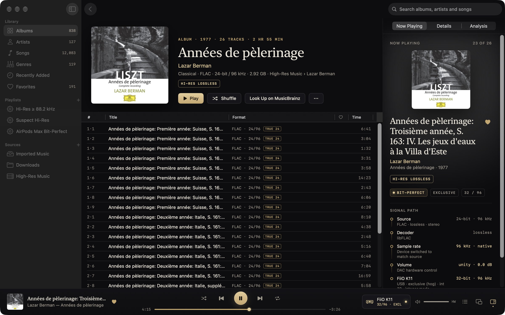

# Vespertine features

Vespertine is a free, open-source Mac player for surround and hi-res music collections. This page has the details and screenshots; the [README](../README.md) has the short version.

## Surround in one library

Extracted SACD 5.1 tracks, multichannel FLAC, DTS CDs, Dolby TrueHD and DTS-HD Master Audio share a library with your stereo albums. SACD images (`.iso`) play straight from the image: stereo and multichannel areas, DST-compressed or plain, each song listed once with both versions, titled from the disc's own text. DST is decoded to the original DSD, so it goes out over DoP bit for bit or through the same DSD → PCM conversion as DSF. The image is read in place and never written to. Two real discs (The Dark Side of the Moon, Brothers in Arms) matched sacd_extract bit for bit; 5.0, multichannel-only and DSD128+ discs are covered only by synthesized images. Extracted DSF, DFF or PCM tracks work too.

Surround renders as head-tracked or fixed Spatial Audio on AirPods, or folds down by channel layout on a stereo DAC. Dolby Digital Plus with Atmos uses macOS's object renderer. TrueHD Atmos and DTS:X play their lossless channel bed; their objects are not rendered.

Channel-for-channel output to multichannel interfaces and AV receivers is experimental, untested on real receivers/multichannel DACs; reports wanted. Routing is covered by automated tests and a six-channel aggregate-device check. Those checks do not establish compatibility with a hardware interface or receiver.

When an album contains stereo and surround versions, each song is listed once. Vespertine chooses the version for your output, or you can pin a version in Settings. Switching from a stereo DAC to AirPods changes the upcoming songs' selection.

DTS CDs and DTS-WAV files store a DTS stream in what looks like stereo PCM. Vespertine detects the stream and decodes it to 5.1, including CUE-split albums. Ordinary PCM playback of that data would be noise. Format badges name the codec and channel layout, and the signal path has a meter for each channel.

Receiver bitstream is experimental, untested on real receivers/multichannel DACs; reports wanted. The per-output option packs Dolby Digital, Dolby Digital Plus and DTS-CD data into IEC 61937 carriers. Dolby Digital Plus needs HDMI. Carrier tests compare the data with FFmpeg's S/PDIF reader. TrueHD and DTS-HD MA receiver passthrough is unsupported on macOS.

Export for Spatial Audio makes binaural stereo for headphones or multichannel ALAC for Apple devices. It copies tags and artwork, handles CUE tracks, and leaves the originals in place.

## Signal path and DAC output

The signal path lists decoding, device rate and physical format, gain, resampling and channel processing. BIT-PERFECT appears only when the rate is native, no processing changes the samples, the word length fits, and the device is exclusive or no other app is detected playing to it. See the [conditions in code](../Packages/VespertineKit/Sources/VespertineAudio/SignalPath.swift), [architecture](ARCHITECTURE.md), and [verification guide](VERIFICATION.md).

Shared-mode checks poll about once a second. Short sounds and activity Core Audio does not report can escape detection. Processing inside a DAC or headphones is outside what macOS reports. A signal-path badge is not an independent digital loopback measurement.

Vespertine switches the DAC to each track's native rate. PCM playback has been tested up to 384 kHz on a FiiO K11. If the DAC cannot run the source rate, Apple's mastering-quality resampler converts it. The planner prefers the same rate family, then a higher rate, then an integer divisor. Per-device settings can match the source, use the device maximum, or force a rate.

Shared output keeps the Mac's volume controls available. By default the selected playback device also becomes the Mac's sound output; Settings can disable that. Exclusive (hog) mode keeps other apps off the device and releases it after a configurable pause. The built-in speakers and headphone jack use shared mode. Speakers and virtual or aggregate devices are not labelled BIT-PERFECT.

Integer mode needs exclusive access and a DAC with a non-mixable 32-bit integer format. It sends unprocessed PCM as integers, including 32-bit recordings that the normal Float32 path would round. The float path preserves up to 24 significant bits. Vespertine uses hardware volume where available; optional digital volume and ReplayGain appear in the signal path when they change the samples.

Vespertine waits for your selected device if it is missing, for up to a minute at playback start. If it disconnects during a song, playback resumes from the same position when it returns. At quit, each device is restored to its earlier rate and depth, or your chosen default. Tracks with the same output format play gaplessly, including CUE-sheet albums.

## DSD and AirPods Max

DSF and DSDIFF files decode from DSD64 to DSD512. On a DAC marked DoP-capable, DSD is packed into DoP frames when the DAC supports the carrier rate. Otherwise it becomes high-rate PCM, with the conversion shown in the signal path. DoP is off until enabled for a device because a non-DoP DAC would play the carrier as noise. DoP has only been confirmed on a FiiO K11; carrier rates above 384 kHz have not been tested on hardware. DSD256/512 file support does not establish native playback at those rates on a real DAC.

AirPods Max on USB-C are recognized as a lossless 24-bit / 48 kHz device. Unprocessed 48 kHz tracks meet the app's bit-perfect conditions; other rates are converted to 48 kHz. This rests on Apple's description of the cable path and Core Audio readback, since AirPods have no digital output for a loopback test. Over Bluetooth the signal path reports AAC. AirPods Max 2 detection is implemented by name but untested.

## File analysis

Analysis detects zero-padded bit depth exactly. Possible upsampling, lossy origin and synthetic high frequencies are spectral estimates, shown as questions with measurements and alternative explanations. Steep mastering filters, FM sources and tape or vinyl transfers can look suspicious; some high-bitrate lossy sources pass undetected. [How it works and where it misses](ANALYSIS.md#limits).

This is a feature other players offer too, including VeraVox and Audirvana AudioScan. Results can run on import, filter the library, or populate a Suspect Hi-Res smart playlist. For a NAS collection, `vespertine-analyze` runs the same core beside the files; the app imports the results.

The screenshot uses a deliberate fake: the trailer's music encoded to MP3 and upsampled to 24/192, under a fictional band name. [Reproduce an analysis file](ANALYSIS.md#reproducing).

## Browsing, playlists and metadata

Albums, artists, songs and genres each have their own saved filters. Format chips combine with genre, year, artist, rate, depth, channels, analysis verdict, source and favorites. Play and Shuffle follow the filters. Album dates use original release tags when present. Genre spelling variants and multi-genre tags are grouped.

Search covers artists, albums and songs, including genre and year. Every typed word must match; case and accents are ignored. Favorites stay in the library, with a heart in song lists, the transport, Now Playing, the mini player and the menu-bar extra. Command-L favorites the playing song.

Smart playlists use the same units as the rest of the app, such as 24-bit and 48 kHz. M3U and M3U8 import and M3U8 export work with other players. Importing Apple Music's exported library XML brings playlists, favorites and play counts.

Folders are watched in place, or Import & Organize copies files into `~/Music/Vespertine`. Copies on the same APFS volume use clones. Offline drives remain in the library; deleting a file removes it on the next scan. Recognized moves and renames preserve playlists, play counts and analysis. Covers come from embedded tags or album folders, including a folder above individual discs.

Find Music on This Mac searches Spotlight-indexed drives. It checks file formats and can select hi-res, lossless or all music by folder or file, while excluding recordings, prompts and duplicate copies.

The tag editor handles single files or batches through TagLib, including artwork, sort fields, lyrics and custom tags. Each file has a backup and one-step revert. Read-only files and individual CUE tracks keep edits in the library instead. Enrich Metadata proposes values from structured filenames and MusicBrainz, with source and confidence shown before writing. Cover art lookup uses the Cover Art Archive. ListenBrainz scrobbling is optional, with the token in Keychain. [Privacy](../site/privacy.html).

## EQ, meters and controls

The parametric EQ has up to 20 peak, shelf, low-pass and high-pass bands plus a preamp. It runs in 64-bit and dithers to the DAC's word length. Import AutoEQ `ParametricEQ.txt` or Equalizer APO configurations, inspect the curve and clipping risk, and choose a preset per output. It is off by default. An active preset that changes samples replaces BIT-PERFECT with EQUALIZER. Convolution and audio effect plugins are not supported.

EQ does not process DoP, system-rendered Atmos, or the experimental receiver bitstream path, which is untested on real receivers/multichannel DACs; reports wanted.

Meters and the live spectrum include DoP monitoring. A mini player, menu-bar extra, Now Playing integration and media keys keep playback controls available. Codec-library exceptions become playback errors where possible; a deeper decoder crash still needs a report.

## Network collections

SMB, NFS and WebDAV shares are read-only by default, with credentials in the login Keychain. Vespertine reconnects after sleep, network changes or server restarts and rescans every half hour while idle. Playback buffers ahead and pauses without consuming music when a read stalls. Played tracks are cached; Keep Offline retains whole albums.

For lossless PCM and DoP, a completed local copy can replace the network source mid-song at the same sample. Automated tests cover the continuity. Lossy decoding and DSD-to-PCM keep using the share for the current song because their decoders carry state across a seek.

## Formats

| Format | Files | Path |
|---|---|---|
| FLAC, ALAC, WAV, AIFF | `.flac` `.m4a` `.wav` `.aiff`, CUE-sheet images | Native rate when the DAC supports it; PCM hardware tested to 384 kHz. Unchanged 32-bit PCM needs integer mode. |
| DSD64 to DSD512 | `.dsf` `.dff` | DoP if the DAC supports the carrier, otherwise PCM. Hardware carrier rates above 384 kHz are untested. |
| SACD images | `.iso` (stereo and multichannel areas, DST or plain) | DSD64, the same way as DSF and DSDIFF; each song listed once with its stereo and 5.1 versions |
| Dolby Atmos | DD+ with Atmos in `.ec3` `.m4a` `.mp4` | macOS object renderer, or decoded channel bed |
| Dolby TrueHD, MLP | `.thd` `.mlp` `.mka` | Lossless channel decode; TrueHD Atmos objects are not rendered |
| Dolby Digital, Dolby Digital Plus | `.ac3` `.ec3`, Dolby in `.m4a` `.mp4` | macOS decode; receiver bitstream is experimental, untested on real receivers/multichannel DACs; reports wanted |
| DTS-HD MA, DTS-HD HR, DTS | `.dts` `.dtshd` `.mka` | FFmpeg decode; MA is lossless; DTS:X objects are not rendered |
| DTS CDs, DTS-WAV | `.wav` `.flac` with optional `.cue` | Decode to 5.1; receiver bitstream is experimental, untested on real receivers/multichannel DACs; reports wanted |
| APE, WavPack, TTA | `.ape` `.wv` `.tta` | Lossless PCM; DSD inside WavPack is unsupported |
| Opus, Vorbis, Musepack, MP3, AAC | `.opus` `.ogg` `.mpc` `.mp3` `.m4a` | Decoded and marked lossy |

TrueHD decoder fixtures are compared sample for sample with their source; DTS output is compared with FFmpeg's decoder on a real disc rip. Tested playback hardware is a FiiO K11, AirPods Max over USB-C and Bluetooth, and MacBook Pro speakers. The Intel build has run under Rosetta, not on an Intel Mac. No streaming services or DRM-protected Apple Music downloads. [Verification and its limits](VERIFICATION.md).
